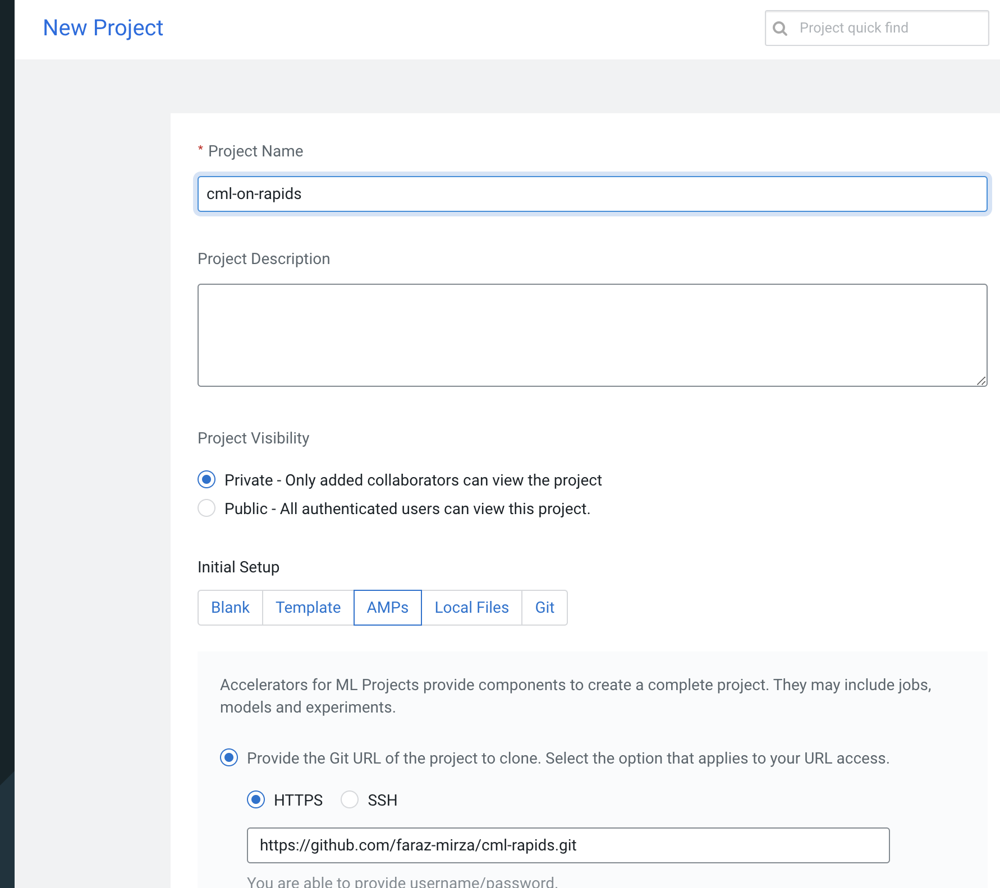
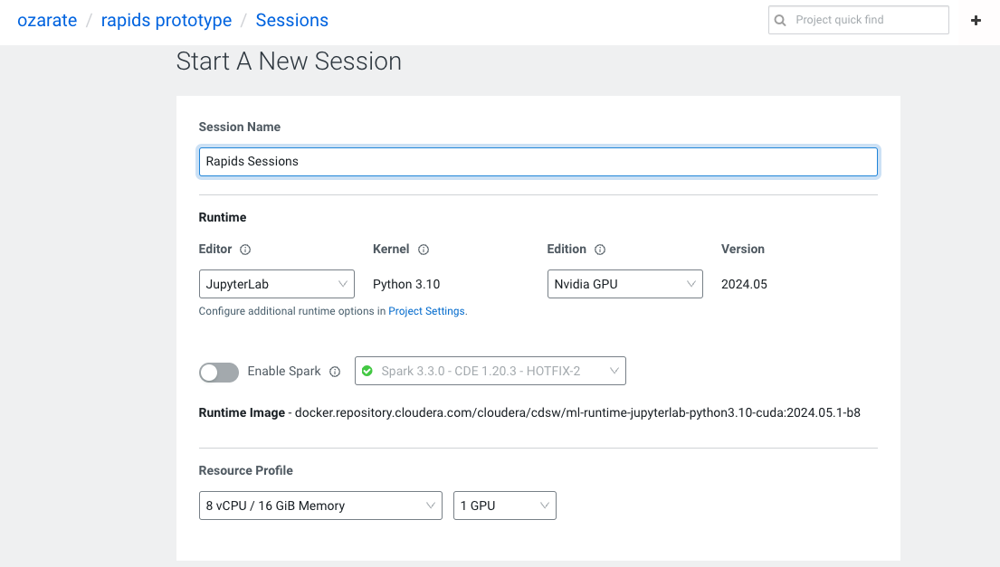
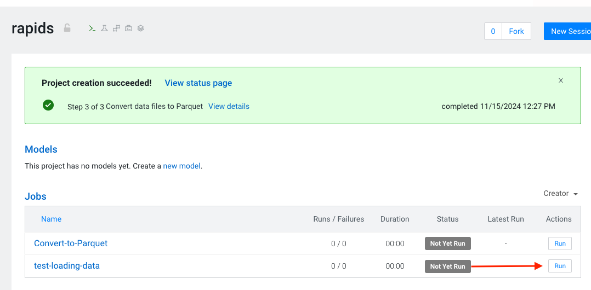
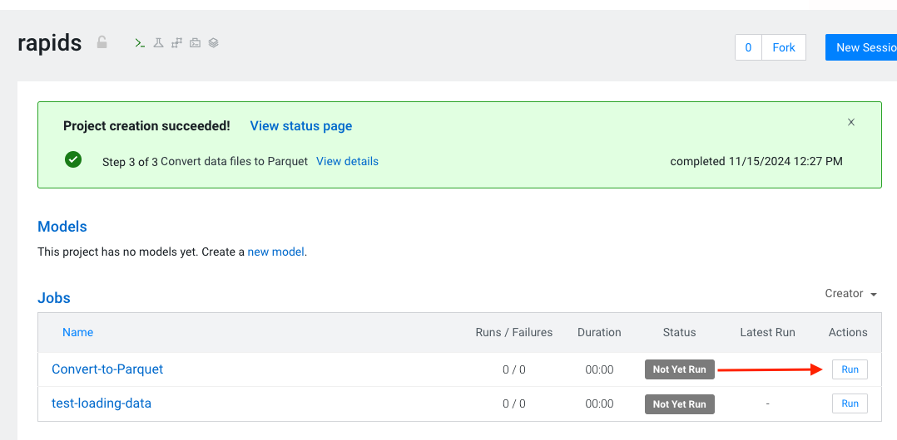
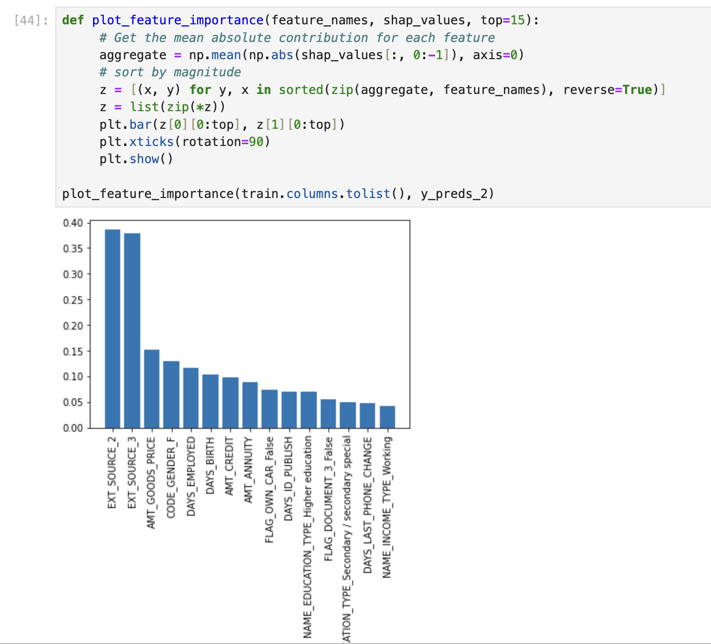

# RAPIDS.ai on Cloudera CML

In this article, we will cover leveraging RAPIDS to accelerate your machine learning projects on Cloudera's CML Platform

## Introduction

We expanded our partnership with NVIDIA, enabling your data teams to dramatically speed up compute processes for data engineering and data science workloads with no code changes using RAPIDS AI. RAPIDS on the Cloudera Data Platform comes pre-configured with all the necessary libraries and dependencies to bring the power of RAPIDS to your projects.

## What is RAPIDs

RAPIDS brings the power of GPU compute to standard Data Science operations, be it exploratory data analysis, feature engineering or model building. For more information see: <https://rapids.ai/>. The RAPIDS libraries are designed as drop-in replacements for common Python data science libraries like pandas (cuDF), numpy (cuPy), sklearn (cuML) and dask (dask_cuda). By leveraging the parallel compute capacity of GPUs the time for complicated data engineering and data science tasks can be dramatically reduced, accelerating the timeframes for Data Scientists to take ideas from concept to production.

## Scenario

In this tutorial, we will illustrate how RAPIDS can be used to tackle the Kaggle Home Credit Default Risk challenge. The Home Credit Default Risk problem is about predicting the chance that a customer will default on a loan, a common financial services industry problem set. To try and predict this, an extensive dataset including anonymised details on the individual loan and their historical credit history are included. See https://www.kaggle.com/c/home-credit-default-risk/overview for more details.

As a machine learning problem, it is a classification task with tabular data, a perfect fit for RAPIDs.

The focus of this tutorial will be on the mechanics of leveraging the RAPIDs library and not on building the best performing model for the leaderboard. To see more information on the winning submission See: https://www.kaggle.com/c/home-credit-default-risk/discussion/64821

## Project Setup

To follow along, clone the repo at: https://github.com/faraz-mirza/cml-rapids.git into a new CML Project. 


In the next screen you'll be prompted to review the runtime details. Review, then click "Launch Project". CML will identify a yaml file that will conduct the build steps including install dependencies as well as building jobs used in the lab.

In this example we will use a Jupyter Notebook session to run our code. 
Create a session with 8 cores, 16GB memory and 1 GPU. Before you do so, check to make sure that this resource profile exists. If not, created it. You can check by going to site administration, run times, then scroll down the resource profiles section.





## Get the Dataset

For the code to work, the data in it's CSV format should be placed into the data subfolder. The dataset can be downloaded from: https://www.kaggle.com/c/home-credit-default-risk/data


To validate that our image is working and that RAPIDS is correctly configured, run the job called `Testing` from a terminal session in jupyterlab.


The script will go through loading RAPIDs libraries then leveraging them to load and processing a datafile.

Common problems at this stage can be related to GPU versions. RAPIDS is only supported on newer NVIDIA gpus. For AWS this means at least P3 instances. P2 GPU instances are not supported.


### Data Ingestion

The raw data is in a series of CSV files. We will firstly convert this to parquet format as most data lakes exist as object stores full of parquet files. Parquet also stores datatypes which makes reading back and processing the files later slightly easier.

Run the `Convert to Parquet` job. This will open the csvs with correctly data types then save them out as parquet in the `raw_data` folder. 


Now we have all our parquet datasets to continue on our RAPIDS journey


Exploring the dataset, there are numerical columns, categorical and boolean columns. The `application_test` and `application_train` files contain the main features that we will be building our model off of whilst the other tables provide some supplementary data. Feel free to skim through: `First_Exploration.ipynb` in order to see some basic exploration of the datasets. 

In the `First_Exploration.ipynb` we also leverage `cuXfilter`, a RAPIDS-accelerated cross filtering visualization library for some of the charts.

### Simple Exploration and Model

As with all Machine Learning problems, lets start with a simple model. This gives us the opportunity to build a baseline to improve off of and also to check that Machine Learning can learn something off the data right off the bat.

Open `A_First_Model.ipynb`

At the start of this notebook, you can choose which set of libraries to load.
The RAPIDs set or the Pandas set. Just run one of these cells.


This notebook goes through loading just the train and test datasets


Some simple filtering out of columns with a lot of missing values


It is worth noting that although RAPIDS `cudf` is mostly a drop in replacement for `pandas`, we do need to change some parts to make it work seamlessly.

```python
if type(df_app_train_miss_values) == cudf.core.dataframe.DataFrame:
    drop_columns = df_app_train_miss_values[df_app_train_miss_values['missing percent'] \
                                        >= 40]['columns'].to_arrow().to_pylist()
else:
    drop_columns = df_app_train_miss_values[df_app_train_miss_values['missing percent'] \
                                        >= 40]['columns'].tolist()
```

The training of the model


And analysing the results.


From our testing, the RAPIDS accelerated pipeline is ~28% faster.
### Feature Engineering

Now that we have a feel for how this works, lets look at a more advanced feature engineering pipeline.
For our simple feature engineering pipeline, we only used the main training table and didn't look at the other tables in the dataset.

For our advanced feature engineering pipeline, we will include the auxiliary data and also engineering some additional features.

Open the Comparing_Frameworks.ipynb file to see compare how cudf and pandas compare.

    NOTE: The function for engineering the features have been written to be compatible with Pandas and cuDF and can be found in `feature_engineering_2.py` 

The notebook is split into two sections. RAPIDS cuDF and Pandas.
From our testing, we see the following in terms of performance:

| Process        | RAPIDS (wall time) | Pandas (wall time)  |
| ------------- |:-------------:| :-----:|
| Ingest Data      | 2.62 secs | 4.94 secs |
| Generate Features      | 25.1 secs | 76.1 secs |
| Write Data | 4.94 secs | 9.52 secs |

This is based on a P3 Worker with 8 Cores and 16 GB RAM.

We can see that for all parts of the process, RAPIDs offers higher performance than raw Pandas. It is worth noting at this stage, that RAPIDs cuDF can only take advantage of one GPU. Should we wish to scale beyond a single GPU, we will need to leverage `dask_cudf`.

### Next Steps

If you would like to learn more about how you can leverage RAPIDS to accelerate your Machine Learning Projects in Cloudera Machine Learning, be sure to check out part 1<https://blog.cloudera.com/enabling-nvidia-gpus-to-accelerate-model-development-in-cloudera-machine-learning/> & part 2<https://blog.cloudera.com/deep-learning-with-nvidia-gpus-in-cloudera-machine-learning/> of the blog series.